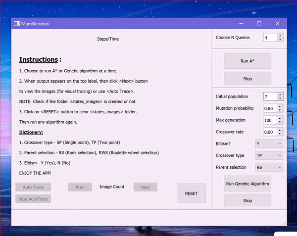

# N-Queens PuzzleSolver (A* and GeneticAlgorithm) 
   
   
   
   
   
   Course Project 1: ICS 381/202 - Principles of Artificial Intelligence

## Description
   Design a GUI for solving N-Queens problem using A* and Genetic Algorihtms. For more details, see *202-ICS381-PA01.pdf*.
   
## Demo GIF/Screenshots
<details>
   <summary>Click to expand!</summary>
   GUI demo:

   

   **Note:** We can use the algorithms as a text-based instead of GUI. Under ````algorithms/```` folder, run the corresponding algorithms by calling static functions
   ````RunAStarAlgorithm.run_a_star()```` for A* and ````RunGeneticAlgorithm.run_ga()```` for Genetic algorithm and pass their parameters. One additional task has to be
   done if you are using text-based UI i.e. create a folder called ````states_images```` (this folder stores the images of states).

   Screenshots of A* and Genetic Algorithm (Text-based UI):
   
   
   
   
   
   >*I recommend using text-based UI for an in-depth comparative study.*
      
</details>
   
## Installation And Usage
<details>
  <summary>Click to expand!</summary>
   
  1. Installation
   - Download/clone this repository. Then open terminal (make sure you are in the project's directory).
   - Create a virtual environment using the command ````py -m venv yourVenvName```` and activate it using ````yourVenvName\Scripts\activate.bat````.
   - Then run the following command ````pip install -r requirements.txt````. With this, all the dependencies will be installed in your virtual environment. 

   > **Note:** *If any dependency is missing or an error shows up, install it using ````pip install moduleName````*.

  2. Usage
      - Open your project folder and go to the terminal and activate your virtual environment. 
      - Run PA1.py file.
     
</details>

